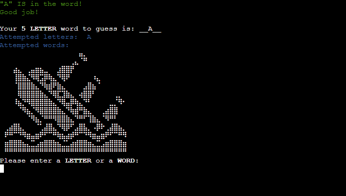
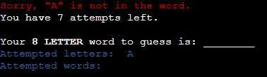
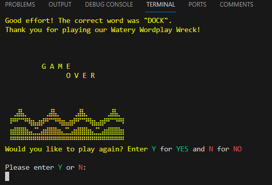

# Watery Wordplay Wreck

Welcome to my third milestone project, Watery Wordplay Wreck.

Watery Wordplay Wreck is a word-guessing game built with Python. It is a <a href="https://en.wikipedia.org/wiki/Hangman_(game)" target="_blank">Hangman</a> inspired game in the style of a sinking ship to represent the progress of the game.

The user can choose the number of lives per game to set the difficulty. Through the process of making guesses, either letter by letter or by attempting to guess the entire word, the user endeavors to identify the correct word before the ship succumbs to the depths of the sea. With each unsuccessful attempt, the user loses a life, resulting in the gradual sinking of the ship.

The primary objective of this project is to showcase my comprehension and application of the Python modules I have studied thus far. By integrating them into a real-world project, I aim to demonstrate my proficiency in design and development. This terminal application, constructed using a template provided by <a href="https://github.com/Code-Institute-Org/p3-template" target="_blank">Code Institute</a> along with my Python code, serves as a tangible representation of my acquired skills.

I appreciate you taking the time to explore my project, and I sincerely hope you find as much enjoyment in it as I did during the design and development phases.

<a href="https://watery-wordplay-wreck-submit-73ab1e8a5637.herokuapp.com/" target="_blank">View the live project</a>

<a href="https://github.com/HCaldwell95/watery-wordplay-wreck-submit" target="_blank">View the GitHub repository here</a>

<em>Note: While developing this project, I recognised shortcomings in my demonstration of version control. To address this, I have reconstructed the repository, ensuring proper version control practices are now in place. You can find a link to the previous repository <a href="https://github.com/HCaldwell95/watery-wordplay-wreck" target="_blank"> here</a>.</em>

# Table of Contents

1. [Introduction](#introduction)
2. [UX - User Experience Design](#ux---user-experience-design)
   1. [User Stories](#user-stories)
3. [Logic Flow](#logic-flow)
4. [Existing Features](#existing-features)
   1. [Welcome Page](#welcome-page)
   2. [Rules Page](#rules-page)
   3. [Game Screen](#game-screen)
   4. [End Game Page](#end-game-page)
5. [Python Libraries Used](#python-libraries-used)
6. [Technologies Used](#technologies-used)
   1. [Programming Language](#programming-language)
   2. [Tools Used To Develop The Game](#tools-used-to-develop-the-game)
7. [Testing](#testing)
   1. [Code Validation](#code-validation)
   2. [Manual Testing](#manual-testing)
   3. [Resolved Bugs](#resolved-bugs)
8. [Deployment](#deployment)
   1. [Preparation](#preparation)
   2. [Deploying the Application to Heroku](#deploying-the-application-to-heroku)
   3. [Forking the GitHub Repository](#forking-the-github-repository)
   4. [Cloning the Repository on GitHub](#cloning-the-repository-on-github)
9. [Credits](#credits)
   - [Code](#code)
   - [Media](#media)
10. [Disclaimer](#disclaimer)

## UX - User Experience Design

### User Stories

As a first-time user:
  - I would like to understand how the game works and how to play with ease.
  - I would like the flexibility to tailor the difficulty to match my skill and comfort.
  - I would like prompt feedback for every guess I make during the gameplay.
  - I would like visibility of any letters or words previously used to avoid using them again.
  - I expect to receive an error message with an explanation if my guess is deemed invalid.
  - I wish to monitor my progress throughout the game.
  - I would like the option to either replay the game or conclude my session once the game concludes.

As a returning user:
  - I would like to be able to relearn the game quickly and easily.
  - I would like the challenge to remain and encounter different words than my last visit.

## Logic Flow
To organise the logical flow of the game, I created a flow chart that outlines the individual steps. Each step is color-coded to differentiate between various types of activities.

## Existing Features

### Welcome Page

This serves as the initial greeting for the game, featuring the game title rendered in ASCII Art. Users are prompted to initiate the game by pressing ENTER.

---

### Rules Page

Once the user has pressed ENTER, the terminal clears and they will be taken to the Rules Page. This page consists of:
  -  A 'RULES' Title - again rendered in ASCII Art.
  -  The rules of the game and explanation of the objective.
  -  A user prompt to select their difficulty by selecting the desired number of lives.

---

### Game Page

Upon selecting the preferred number of lives, the game commences. Each session introduces a randomly chosen nautical-themed word, presenting a sinking ship image that dynamically reflects the remaining lives. The screen consistently displays the number of letters in the secret word.

At the bottom of the page, the user is prompted to input either a letter or a word.

 

 

Each user input undergoes validation checks to determine its presence in the word or if it matches the actual word. If the user's input is found in the word, constructive feedback is provided. The revealed letter appears in the "The word to guess" field, aiding the user in tracking the word's progress.

 

If the user's input is not part of the word, feedback is shared, along with the remaining lives count. With each unsuccessful attempt, the user loses a life, and the ship begins to sink.

 

 

If a word with the same number of letters as the target word is suggested, it is checked against the secret word. If the word is a match, the game concludes with a user victory. If not, the user loses a life and the ship descends deeper into the ocean. 

 

After the first attempt, the letters and words that have already been used are displayed, offering assistance to the user.

The user then continues to guess one letter at a time or opts to propose the entire word until either the correct word is guessed, leading to the game's conclusion, or the user exhausts all lives. 

---

### End Game Page
Upon completion of the game, users are transitioned to the End Game Page.

If the word is successfully guessed, the screen showcases a triumphant "Congratulations!" message accompanied by the secret word and ASCII Art to reiterate their success.

 

In the event of an unsuccessful guess resulting in no lives remaining, the "Good effort!" message appears, followed by the correct word and complemented by an ASCII Art depiction of an ocean without a ship.

 

On this conclusive page, users can either:
  - opt to replay the game, which will redirect them to the Rules Page to choose new lives
   or
  -  conclude the game, redirecting them back to the Welcome Page.

### Future Features to Implement

The game currently lacks personalisation and ownership. I aim to implement a feature enabling users to input their usernames, and their highest (and lowest) scores would be stored in a database, visible to all users through a leaderboard-style interface. This addition, featuring a leaderboard displaying the names and scores of past players, will enhance player engagement and promote continued gameplay.

## Python Libraries Used 
### random:
  - The random library was incorporated to allow the application to randomly select a word from words.py for each game instance.
### os:
  - The os library facilitated communication with the operating system to refresh the terminal at various points throughout the game. This enhanced the user's experience by providing a cleaner and more enjoyable interface.

## Technologies Used
### Programming Language
  - Python was used to build the main content of the game.

### Tools Used To Develop The Game
  - <a href="https://www.gitpod.io/" target="_blank">Gitpod</a> served as the platform for creating, editing, and previewing code throughout the development process.
  - <a href="https://git-scm.com/" target="_blank">Git</a> was employed for version control, managing and tracking changes in the codebase.
  - <a href="https://github.com/" target="_blank">GitHub</a> was utilised to store both the repository and the codes.
  - <a href="https://dashboard.heroku.com/apps" target="_blank">Heroku</a> was chosen as the deployment platform for the application.

### Other Online Resources
  - <a href="https://lucid.app" target="_blank">Lucid Charts</a> was used to plan and create the logical flow of the game.
  - <a href="https://app.grammarly.com/" target="_blank">Grammarly</a> was used to proof all files and remove grammatical and typographical errors.
  - <a href="https://www.notion.so/" target="_blank">Notion</a> was used to make notes and to store essential images throughout the development process. Notion also handled the compression of images in the process.

  ## Testing

### Code Validation

The application underwent thorough validation to identify and rectify any syntax errors. The <a href="https://pep8ci.herokuapp.com/">CI Python Linter</a> was employed for this validation process, and it successfully confirmed the absence of errors in the code.

  
Validation Results for run.py

  

  
Validation Results for sinking_ship.py

  

  
Validation Results for ascii_art.py

  

  
Validation Results for words.py

  

  
Validation Results for game_over.py

  

  
Validation Results for game_winner.py

  

  
Validation Results for font_styles.py

  

## Manual Testing

### Welcome Page
| Step  | Description                | Anticipated Outcome                                                        | Observed Outcome                                 | Status      |
| :---: | -------------------------- | -------------------------------------------------------------------------- | ------------------------------------------------ | :---------: |
| 1     | Deployed Website           | Welcome Page loads with no issues                                          | Welcome Page loads as expected                   | Pass        |
| 2     | Display Title ASCII Art    | Title loads with ASCII Art rendering                                       | ASCII Art loads as expected                      | Pass        |
| 3     | Font Styles                | Font styles are displayed correctly                                        | Font styles are displayed as expected            | Pass        |
| 4     | User Input / Clear Terminal| Once the user presses ENTER, the terminal clears and loads the Rules Page  | The terminal clears and the Rules Page is loaded | Pass        |

### Rules Page
| Step  | Description         | Anticipated Outcome                                                                 | Observed Outcome                                 | Status      |
| :---: | ------------------- | ----------------------------------------------------------------------------------- | ------------------------------------------------ | :---------: |
| 1     | Rules Page          | Rules Page loads with no issues                                                     | Rules Page loads as expected                     | Pass        |
| 2     | Display Title ASCII | Title loads with ASCII Art                                                          | ASCII Art loads as expected                      | Pass        |
| 3     | Font Styles         | Font styles are displayed correctly                                                 | Font styles are displayed as expected            | Pass        |
| 4     | User Input          | Only "4", "6" and "8" are accepted                                                  | Input validation works as expected               | Pass        |
| 5     | Input Validation    | If the input is not valid, display error message                                    | Error message is displayed as expected           | Pass        |
| 6     | Input Validation    | Continues to request an input until a valid input is provided                       | Loops function as expected                       | Pass        |
| 7     | User Input          | Once a valid input has been entered, the terminal clears and the Game Page is loaded| The terminal clears and the Games Page is loaded | Pass        |

 

The image below demonstrates the input validation in action. If the user's input is deemed invalid, a yellow error message is displayed and the user is prompted to choose the number of lives again until a valid input is provided.

 

### Game Page
| Step  | Description             | Anticipated Outcome                                                                 | Observed Outcome                                                            | Status      |
| :---: | ----------------------- | ----------------------------------------------------------------------------------- | --------------------------------------------------------------------------- | :---------: |
| 1     | Game Page               | Game Page loads with no issues                                                      | Game Page loads as expected                                                 | Pass        |
| 2     | Font Styles             | Font styles are displayed correctly                                                 | Font styles are displayed as expected                                       | Pass        |
| 3     | No. Letters Display     | When the page is loaded, the word length is displayed                               | Error message is displayed as expected                                      | Pass        |
| 4     | ASCII Art (Ship)        | ASCII art for sinking ship is displayed correctly based on lives remaining          | ASCII Art loads as expected                                                 | Pass        |
| 5     | Input Validation        | Checks if user input is in the alphabet, if not, an error message is displayed      | Error message is displayed as expected                                      | Pass        |
| 6     | Input Validation        | Validates the length and uniqueness of the input, offering feedback accordingly.    | If input has been used, an error message is displayed as expected           | Pass        |
| 7     | Input Validation        | Checks if the input matches the word length and hasn't been attempted, and provides feedback if it's the correct word.|The displayed feedback aligns with the expected correctness of the input. | Pass |
| 8     | Input Validation        | Correctly guessing the word leads to the game ending with a congratulatory message. Incorrect guesses result in life loss, and the guessed word is displayed. The game proceeds to the next attempt. | Successful word guesses lead to the anticipated end-of-game screen; unsuccessful ones deduct a life and proceed to the next attempt if lives remain. | Pass |
| 9     | ASCII Art Progression   | If the guessed letter or word proves to be incorrect, causing a reduction in their remaining lives, the ASCII art will then depict the corresponding image based on the updated number of lives. |The ASCII art image adapts as expected | Pass |
| 10    | Input Validation        | If the user input consists of more than one letter but does not match the length of the secret word, an error message will be shown.| Error message is displayed as expected | Pass |
| 11    | Input Validation        | If the input consists of a single letter, the system verifies whether the letter has been previously attempted. If it has, feedback is provided.|The feedback is returned as expected. | Pass |
| 12    | Input Validation        | If the input comprises a single letter and has not been attempted before, the system examines whether the letter is present in the secret word and provides feedback accordingly.| The feedback is returned as expected. | Pass |
| 13    | Secret Word | If the entered letter is part of the word and the word hasn't been completely guessed, the system reveals the letter in the "Secret Word" and proceeds to the next attempt. If the letter is not in the word, the user loses a life, and the guessed letter is recorded for reference in subsequent attempts. If the user exhausts all lives, they are directed to the appropriate End of Game Screen with a "Game Over" message.| If the guessed letter is correct, it is appropriately displayed in the field, and the system proceeds to the next attempt. If the letter is incorrect, the user loses a life as anticipated, and they advance to the next attempt if they still have remaining lives. | Pass |
| 14     | ASCII Art Progression   | If the guessed letter or word proves to be incorrect, causing a reduction in their remaining lives, the ASCII art will then depict the corresponding image based on the updated number of lives. |The ASCII art image adapts as expected | Pass |
| 15    | Remaining Lives         | If the suggested letter or word is incorrect, decrease the number of lives by one and show the updated count if there are more lives left. If the user has exhausted all lives, the game concludes. | The displayed number of lives aligns with expectations unless the user has none remaining. | Pass |
| 16    | Used Letters Display    | The attempted letters are stored and presented alphabetically if there is more than one.| Used Letters were displayed as anticipated | Pass |
| 17    | Play Game Loop          | The game follows this sequence until either the correct word is guessed or the user runs out of lives. | Loop functions as expected | Pass |
| 18    | Clear Terminal | The terminal is cleared when the function is called | The terminal clears as expected | Pass |

The images below demonstrate the input validation in action. If the user's input is deemed invalid, a yellow error message is displayed and the user is prompted to propose a letter or word with the equivalent number of letters as the secret word. This process repeats until a valid input is submitted by the user.

  
Valid letter input and is in secret word

  

  
Valid letter input but is NOT in secret word

  

  
Valid word input but is NOT in secret word

  

  
Invalid letter input: is not in alphabet

  
  

  
Invalid word input: word length does not match secret word

  
  

### End Game Page
| Step  | Description             | Anticipated Outcome                                                                    | Observed Outcome                                            | Status      |
| :-----: | --------------------- | -------------------------------------------------------------------------------------- | ----------------------------------------------------------- | :---------: |
| 1     | End Game Page           | End Game Page loads with no issues                                                     | End Game Page loads as expected                             | Pass        |
| 2     | Display Title ASCII     | Title loads with ASCII Art                                                             | ASCII Art loads as expected                                 | Pass        |
| 3     | Font Styles             | Font styles are displayed correctly                                                    | Font styles are displayed as expected                       | Pass        |
| 4     | Correct Secret Word     | Correct secret word is displayed with appropriate congratulations/good effort message. | Correct word is displayed, paired with the correct message. | Pass        |
| 5     | Restart Game            | The restart game content is displayed on both outcome screens                          | The content is displayed in both outcomes as expected       | Pass        |
| 6     | Input Validation        | Only "Y" or "N" is accepted                                                            | Input is validated as expected                              | Pass        |
| 7     | Input Validation        | If the input is not valid, display error message                                       | Error message is displayed as expected                      | Pass        |
| 8     | Input Validation        | Loop continues, requesting an input until valid input is submitted                     | Loop functions as expected                                  | Pass        |
| 9     | User Input              | After the user inputs a valid command, the terminal is reset. If the choice "Y" is made, the user is returned to the Rules Page to begin a new game. Otherwise, the user is directed back to the Welcome Page. | The terminal clears and the user is returned to appropriate the page                          | Pass        |

### User Stories Testing

I referenced and tested each of my user stories throughout the testing process. Addressing them as follows:

<em>I would like to understand how the game works and how to play with ease.</em>
  - The Rules Page clearly outlines the rules of the game and explains expected inputs.

 

<em>I would like the flexibility to tailor the difficulty to match my skill and comfort.</em>
  - The user is able to choose their desired number of lives, thus setting the difficulty of the game.

 

<em>I would like prompt feedback for every guess I make during the gameplay.</em>
  - Every valid input is examined to check if it is in the word or is the actual word, and corresponding feedback is provided.
    - If the input is correct, a green message is displayed.
    - If the input is incorrect, a red message is displayed along with the number of lives the user has remaining.
    - If the input is invalid, a yellow error message is displayed.

 

<em>I would like visibility of any letters or words previously used to avoid using them again.</em>
  - After the first attempt,l used letters and words are displayed, aiding the user in their quest.

 

<em>I expect to receive an error message with an explanation if my guess is deemed invalid.</em>
  - In case of an invalid input, an error message is presented, clarifying the expected input. This is illustrated in the Game Page section above with examples of the validation in action.

 

<em>I wish to monitor my progress throughout the game.</em>
  - The secret word unveils correctly guessed letters and displays the remaining letters with underscores. If the user's input is incorrect, the remaining lives are displayed - enabling progress tracking.

 

<em>I would like the option to either replay the game or conclude my session once the game concludes.</em>
  - Upon game completion, the user is prompted to either start another game or conclude the current session, regardless of whether the user had succeeded.

 

<em>I would like to be able to relearn the game quickly and easily.</em>
  - Before a user can play the game, they are directed to the Rules Page which clearly defines the game requirements, allowing for an easy return to the game.

 

<em>I would like the challenge to remain and encounter different words than my last visit.</em>
  - The random word function, when paired with a generous list of potential secret words, aims to satisfy this need for a constant challenge. It is very unlikely that the user will encounter the same words frequently.

## Resolved Bugs

When applying my font styles to alter the text colour throughout this application, I encountered issues where the font colour would persist indefinitely throughout the page from the point it was first called. 

  
Bug Before Fix

  
  

 

To combat this, I created an additional font styling class variable which, through the use of ANSI escape codes, would cause the text to default back to the terminal default styling. I named this class variable "FIN" so that when reading my code back, it was clear where the styles would finish.

        def welcome_page():
        """
        Displays the main title page
        Prompts the user to press ENTER to begin the game
        """
        clear_terminal()

        print(ascii_art.TITLE)
        print(styles.BLUE_BOLD + "\nWelcome to the Watery Wordplay Wreck!" +
              styles.FIN) <---- I inserted the new class variable wherever I wanted the styles to end.

        input("Please press ENTER to begin!\n")
        clear_terminal()
        game_rules()

  
Bug After Fix

  

## Deployment

This application has been deployed using Heroku. 
 <a href="https://watery-wordplay-wreck-5dedc8ac41c5.herokuapp.com/" target="_blank">Link to live project</a>

The steps for deploying the application are as follows:

### Preparation:
1. Ensure proper functionality of input methods in the terminal on the deployed website by adding a new line character \n at the end of each text inside the input method. This ensures that the input request will be correctly displayed in the terminal.

2. If there are dependencies required for running the application on Heroku, update the "requirements.txt" file by running the command pip3 freeze > requirements.txt.

3. Push all updates to GitHub.

### Deploying the Application to Heroku:
1. Log into the Heroku website.

2. From the Dashboard page, click on "New" and then select "Create new app."

3. Assign a name for the application, choose the region, and click "Create app."

4. Once the application is created, go to the "Settings" tab and then "Reveal Config Vars" to set up config vars.

5. In the KEY input field, enter "PORT" in all capitals, and set the VALUE to "8000". Click "Add." If there are other config vars required to run the application, add them here. This application does not require additional config vars.

6. Scroll down to the "Buildpacks" section and click "Add buildpack."

7. Add the necessary buildpacks for the application. For this project, "Python" and "Nodejs" are required.

    - It is crucial to maintain the correct order of buildpacks. "Python" should be the first, followed by "Nodejs." Adjust the order by clicking and dragging if needed.

8. Click "Deploy" in the top submenu.
    - Under "Deployment method", select "GitHub" to connect to GitHub.
    - In the "Connect to GitHub" section, enter the repository name and click "Search."
    - Once the repository is located, click "Connect" to link the repository to the Heroku application.

9. Choose either "Enable Automatic Deploys" to deploy a new version automatically whenever changes are pushed to GitHub or select "Manual Deploy." This application has "Automatic Deploys" enabled.

10. After the deployment, scroll to the top of the screen and click "Open app."

    - If "Enable Automatic Deploys" is selected, the application will be built and available after the next changes are pushed to GitHub.

### Forking the GitHub Repository:

You can fork a GitHub Repository to make a copy of the original repository to view or make changes without affecting the original repository.

1. Find the GitHub repository.
2. At the top of the page to the right, under your account, click the <em>Fork</em> button.
3. You will now have a copy of the repository in your GitHub account.

### Cloning the Repository on GitHub:

1. Find the GitHub Repository.
2. <em>Click</em> the Code button
3. <em>Copy</em> the link shown.
4. In <em>Gitpod</em>, change the directory to the location you would like the cloned directory to be located.
5. <em>Type</em> <code>git clone</code>, and <em>paste</em> the link you copied in step 3.
6. Press <em>Enter</em> to have the local clone created.

## Credits

#### Code

- <a href="https://codeinstitute.net/" target="_blank">Code Institute, Various Tutors</a>
  - Helped me to find solutions to many of my coding issues/queries and allowed me to refer to specific modules for further guidance. Additional credit for providing the terminal in which my project is run.

- <a href="https://www.youtube.com/watch?v=m4nEnsavl6w" target="_blank">YouTube (Kite)</a>
  - This video walkthrough helped me to understand the fundamental requirements of this application and my code has been heavily influenced by this video.

- <a href="https://www.geeksforgeeks.org/clear-screen-python/" target="_blank">GeeksforGeeks</a>
    - Provided the code for clearing the terminal.

- <a href="https://www.studytonight.com/python-howtos/how-to-print-colored-text-in-python">Study Tonight</a>
    - Provided the ANSI code in Python required to style the fonts with colours. 

- <a href="https://www.w3schools.com/python/python_try_except.asp">W3Schools</a>
    - Assisted with exception handling

- <a href="https://chat.openai.com/" target="_blank">ChatGPT</a>
    - This project was developed with the assistance of ChatGPT, a language model created by OpenAI. ChatGPT played a crucial role in troubleshooting code, offering guidance on concise commenting and input validation techniques, and aiding in adhering to character restrictions. The model's capabilities were instrumental in reviewing the code line by line with confirmations for my own benefit.

- <a href="https://stackoverflow.com" target="_blank">Stack Overflow</a>
    - <a href="https://stackoverflow.com/questions/39378020/how-to-display-table-in-readme-md-file-in-github" target="_blank">(Source)</a> - Provided the code to create tables in the README.md.
    - <a href="https://stackoverflow.com/questions/28607382/is-it-possible-to-create-a-toggle-switch-in-markdown" target="_blank">(Source)</a> Provided the code for adding toggle switches in README.md.

### Media

- <a href="https://patorjk.com/software/taag/#p=testall&f=Slant%20Relief&t=Watery%20Wordplay" target="_blank">Patorjk</a>
    - Provided all of the ASCII Art for the titles throughout the application.

- <a href="https://emojicombos.com/" target="_blank">Emoji Combos</a>
    - Provided all of the ASCII Art for the <a href="https://emojicombos.com/sinking-ship-ascii-art" target="_blank">Sinking Ship</a> and <a href="https://emojicombos.com/thumbs-up" target="_blank">Thumbs Up</a>.

## Disclaimer

This project, Watery Wordplay Wreck, is created solely for educational purposes. The content, code, and any associated materials within this project are designed to showcase the developer's understanding and application of programming concepts and should be treated as such.

This project is not intended for commercial use, distribution, or any other purpose beyond educational and learning objectives. Any resemblance to real events, individuals, or entities is purely coincidental.

The developer and contributors disclaim any responsibility for how this project is used outside of its intended educational context. Users are encouraged to respect ethical guidelines and legal considerations when interacting with or utilizing the content of this project.

By accessing and using this project, you acknowledge and agree to use it exclusively for educational and learning purposes.